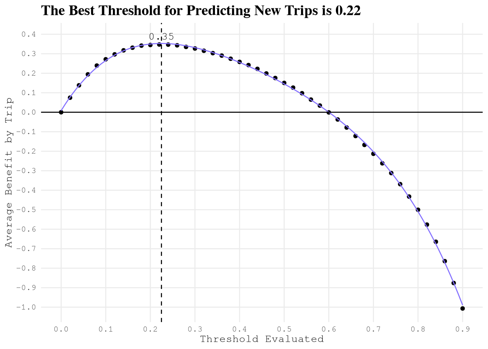
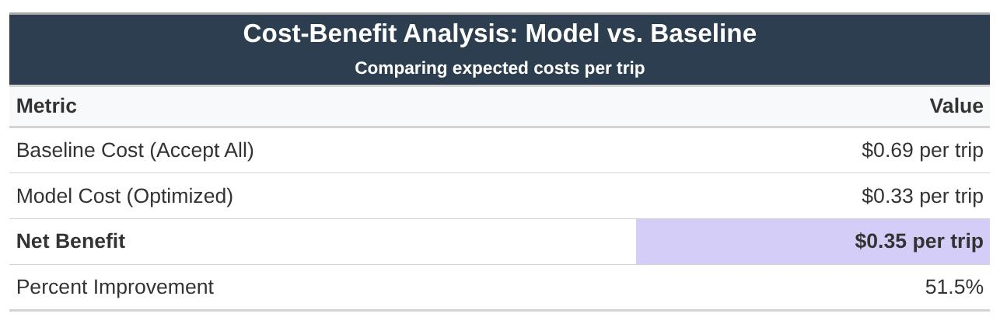
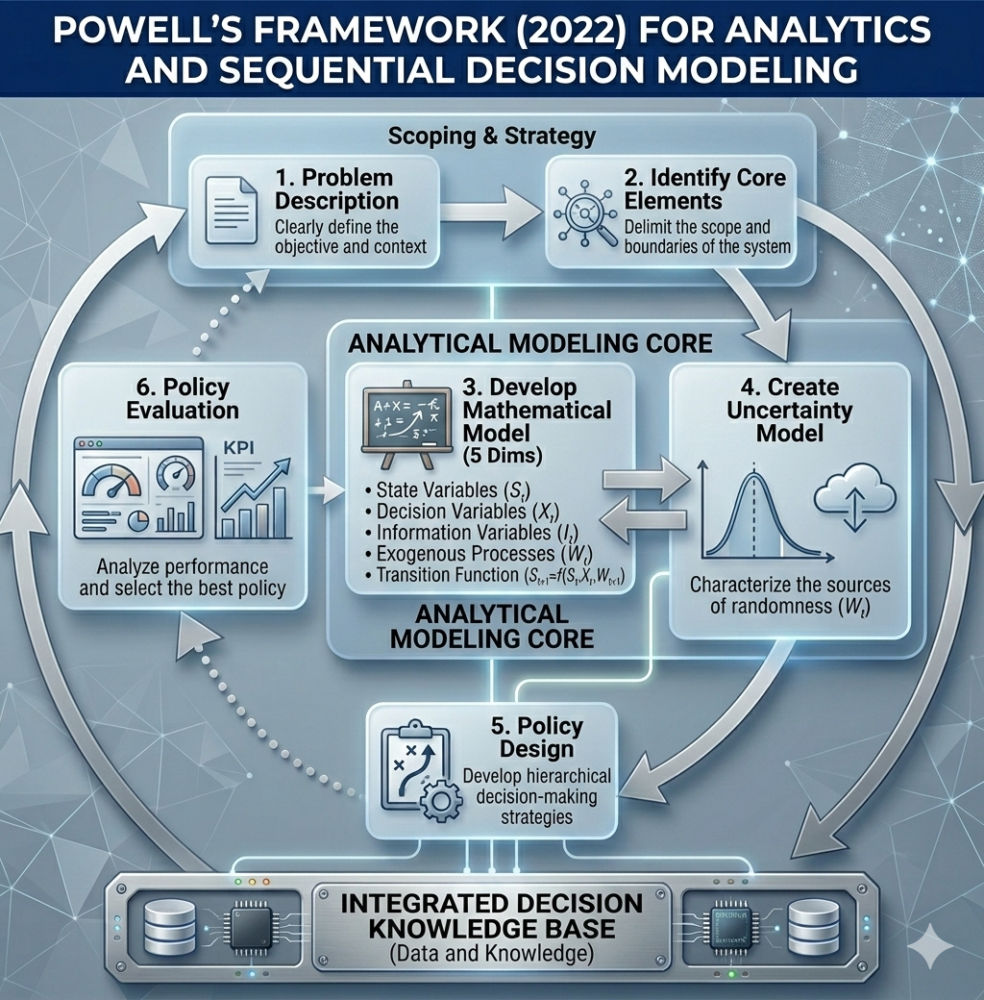
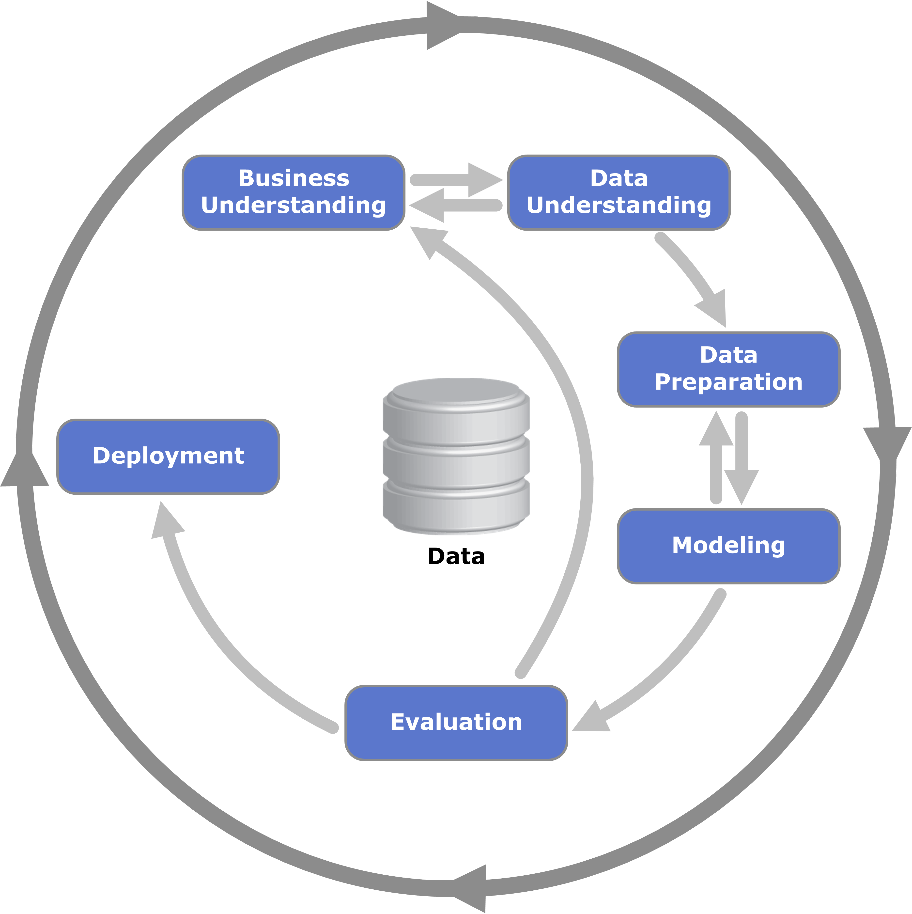
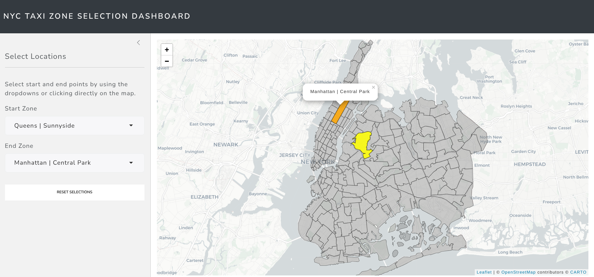

## Problem Description

**Opportunity**

Taxi drivers could **increase their earnings** by changing their strategy.

**Questions to solve**

- How much can a taxi driver increase their monthly earnings just by **skipping trips under defined conditions**?
- How much can a taxi driver increase their monthly earnings just by **changing their initial zone and time**?

**Business success criteria**

Develop a strategy to **increase** NYC taxi drivers' monthly earnings **by 20%**.

**Project scope**

This project will be limited to **Juno**, **Uber**, **Via** and **Lyft** taxi drivers who work in New York City in trips that take place between any zone of **Manhattan**, **Brooklyn** or **Queens** (the more active ones).

## Results Highlight

### 🤖 Modeling for Decision Support

* **Calibration over Accuracy:** For a decision model, the probability must be reliable. I focused on the **Brier Score** and **Calibration Plots** to ensure that a 70% predicted probability of success truly corresponds to a 70% real-world outcome.
* **Robustness:** Evaluation on an **unseen testing set** confirmed that the cost-benefit trade-off remains stable, with the model delivering a **51.5% improvement** over the baseline in simulation-based estimates.





### 🎯 Sequential Decision Framework & Business Logic

The core of this project is not a simple classification task; it is a **Sequential Decision Analytics** problem. I transformed raw observational taxi data into a decision-making tool by addressing two major challenges:

* **The Target Variable Dilemma:** The original dataset lacked a "ground truth" for whether a trip was optimal. I engineered the target variable `take_current_trip` by calculating the **Opportunity Cost** of each trip. This involved simulating the potential earnings of waiting for a high-value fare versus accepting the immediate request, creating a decision-centric label from scratch.
* **The Baseline Paradox:** I established a **"Take-All Policy"** (accepting every trip) as the baseline. While the ML model shows strong predictive performance (AUC and Brier Score), I have framed the project to acknowledge that predictive accuracy does not automatically equate to policy superiority. The model is designed to optimize a threshold that maximizes net hourly earnings, not just "hits and misses."

### 💾 Engineering for Big Data & Software Reliability (Out-of-Core Processing)

I architected a robust, production-grade pipeline designed to handle datasets **exceeding available RAM while maintaining strict software engineering standards**:

- **Custom Tidymodels Extensions:** To integrate geospatial features seamlessly into the machine learning pipeline, I developed a **custom `recipes` step**. This allows for the automated preprocessing of coordinates and spatial joins within a unified workflow, ensuring that feature engineering is consistent during both training and inference.

- **Production-Grade R Development:** To ensure reliability, the project is structured as a **formal R package**, moving beyond simple scripts to a maintainable codebase.

  - **Unit Testing:** I implemented a comprehensive suite of tests using `testthat` to validate custom logic, specifically for the simulation functions and the custom `recipes` steps.

  - **Rigorous Documentation:** All core functions are fully documented using `roxygen2`, providing clear API definitions, parameter requirements, and usage examples.

- **Hybrid Analytical Engine:** I utilized **DuckDB** as an out-of-core engine to perform heavy aggregations and joins directly on disk. Once filtered, I leveraged **data.table** in R for ultra-efficient in-memory manipulation, combining **SQL’s disk performance** with R’s functional programming power.

- **Reproducible Environments:** The entire stack is managed via **Nix and Docker**, ensuring the environment—including complex geospatial system dependencies—is 100% reproducible across any machine.

### 🗺️ High-Dimensional Feature Engineering & Spatial Intelligence

* **Conceptual Clustering (NLP):** To navigate the "Curse of Dimensionality" presented by **160,000+ US Census variables**, I didn't use arbitrary selection. I applied **NLP (Jaccard Distance)** and **Edge-Betweenness clustering** to group variables into conceptual themes (e.g., "Commuting Habits," "Wealth Distribution"), allowing for a data-driven prioritization of features.
* **Geospatial Intersections:** Integrated **OpenStreetMap (OSM)** data by performing **complex spatial intersections**. I mapped road lengths and amenity densities (restaurants, transit hubs) to specific taxi zones to capture the geographic "DNA" of NYC.

## Methodology

To find the optimal solution for those questions, we will follow the methodology proposed by Warren B. Powell (2022) in **Sequential Decision Analytics and Modeling: Modeling with Python** and combine it with the **Cross-Industry Standard Process for Data Mining** (CRISP-DM) to define a machine learning model that will power the sequential decision to optimize.

::: {layout-ncol=2}



:::

Following the steps of both methodologies, we have organized the articles created in this portfolio website:

| **Sequential Decision Analytics** | **CRISP-DM** | **Article Name** |
|:-----------------|:-----------------|:-------------------------|
| **Core Elements of the Problem** | **Business Understanding** | 1. Business Understanding Overview |
| | **Data Understanding** | 2. Data Collection Process |
| **From Defining Mathematical Model to Evaluating Policy** | **Business Understanding** | 3. Defining Base Line |
| | **Data Understanding** | 4. Data Sampling <br> 5. Initial Exploration |
| | **Data Preparation** | 6. Expanding Geospatial Information <br> 7. Expanding Transportation and Socioeconomic Patterns |
| | **Modeling and Evaluation** | 8. Training and Selecting Model To Implement |
| **From Defining Mathematical Model to Evaluating Policy** |  | 9. Implementing ML Model To Sequential Problem _(Pending)_ | 
|  | **Deployment** | 10. Wrap Decision Model into REST API _(Pending)_ <br> 11. Serving Model by a Shiny Web App _(Pending)_ |

## Data to Use

In this project, we will use a subset of the data available in the [TLC Trip Record Data](https://www.nyc.gov/site/tlc/about/tlc-trip-record-data.page) from 2022 to 2023 for **High Volume For-Hire Vehicle** — which covers the Juno, Uber, Via and Lyft trips within our project scope — with the columns described in its [data dictionary](https://www.nyc.gov/assets/tlc/downloads/pdf/data_dictionary_trip_records_hvfhs.pdf).

## Disclaimer

This project was completed under **strong assumptions** given that the data used in the analysis **does not provide any unique identifier for taxi drivers**, which limits the realism of some results.

Additionally, this project aims to increase **taxi driver earnings** at the individual level. However, if applied extensively, it could also produce the following unintended consequences:

1. **Reduced service quality:** Drivers focusing solely on maximizing earnings may avoid less profitable areas or times, potentially leaving some passengers underserved.

2. **Increased congestion:** Drivers congregating in high-profit areas could worsen traffic in already busy parts of the city.

This project is intended as a demonstration of data science methodology rather than a prescriptive business recommendation, and these considerations should be carefully weighed before any real-world implementation.


## Roadmap & Future Developments

### Sequential Decision Analytics (Warren Powell Framework)

The next stage involves moving beyond static evaluation to a dynamic environment. I am integrating the ML model into the framework established by **Warren B. Powell (2022)** in *Sequential Decision Analytics and Modeling*.

* **Policy Function Approximation (PFA):** Using the ML model’s calibrated probabilities to define a decision policy.
* **Four Elements Modeling:** Formally defining the **State** (driver location, time), **Decision** (Accept/Reject), **Exogenous Information** (new trip requests), and the **Objective Function** (Maximizing total daily revenue).

### Deployment & Accessibility

To transition this from a local research project to a production-grade tool, I will implement:

* **REST API:** A R/Plumber API to serve real-time trip recommendations based on the trained XGBoost model.
* **Shiny Dashboard:** An interactive web application built in **Shiny** to visualize the driver’s predicted earnings, optimal decision thresholds, and spatial demand heatmaps in real-time.



Try the app in your browser: [NYC Taxi Zone Selector on Hugging Face Spaces](https://huggingface.co/spaces/AngelFelizR/nyc-taxi-zone-selector)

Source code: [https://github.com/AngelFelizR/nyc-taxi-zone-selector](https://github.com/AngelFelizR/nyc-taxi-zone-selector)

## Project Structure and Tooling

Reproducibility and long-term maintainability were core priorities from the start, which shaped every tooling decision in this project. The following tools were used to achieve this:

1. We use `git` to manage changes in the code and provide an interface to share the project on **GitHub**.
2. `Docker` and `Nix` are used to build a reproducible dev-container based on `default.nix`. The container can be connected via SSH using a public and private key pair as defined in `setup.sh`, and the `.envrc` sets the Nix environment to use in the Positron console.
3. For modeling, we used the `tidymodels` framework to ensure we are following good modeling practices.
4. Since the project follows the basic structure of an R package, we were able to **document** and create **unit tests** for custom functions using `testthat`, `roxygen2` and `devtools`. This was especially important to ensure that the **simulation function** and the custom step function (which extends the `recipes` package) work correctly.
5. The project also follows the structure of a **Quarto project** and renders all articles into the `docs` folder, giving us full control over the format used to present each article. Results are hosted on GitHub Pages, so they can be shared at no cost.
6. The `.Rprofile` overrides `install.packages`, `update.packages` and `remove.packages` to make clear that R packages must be defined in `default.nix` to ensure reproducibility.
7. To manage data larger than RAM, we use `duckdb` and keep large files in a separate folder named `NycTaxiBigFiles` under the same parent directory as this repo.
8. To cache results generated during the investigation process, we use `.qs2` files and track them with `pins`, stored under the folder `NycTaxiPins` in the same parent directory as this repo.
9. We use the **air** extension to ensure consistent code formatting across the project.

The result is a hybrid structure that combines an **R package** (with documented functions and unit tests) and a **Quarto website** (with rendered articles and hosted results), which was one of the most challenging aspects of the project to set up correctly:

```bash
tree -L 3
.
├── about.qmd
├── air.toml
├── default.nix
├── DESCRIPTION
├── docker-compose.yml
├── Dockerfile
├── docs
│   ├── about.html
│   ├── figures
│   │   ├── CRISP-DM_Process_Diagram.png
│   │   ├── htop_parallel_process.png
│   │   ├── logo-generated.jpeg
│   │   ├── model_benefit_curve.png
│   │   ├── model-benefit.jpg
│   │   ├── nyc-taxi-navbar-logo.png
│   │   ├── nyc-taxi-navbar-logo.xcf
│   │   └── Sequential-Decision-Modeling-Framework.png
│   ├── index.html
│   ├── investigation-phases
│   │   ├── 01-business-understanding.html
│   │   ├── 02-data-collection-process.html
│   │   ├── 03-base-line_files
│   │   ├── 03-base-line.html
│   │   ├── 04-data-sampling.html
│   │   ├── 05-initial-exploration_files
│   │   ├── 05-initial-exploration.html
│   │   ├── 06-expanding-geospatial-data_files
│   │   ├── 06-expanding-geospatial-data.html
│   │   ├── 07-expanding-transportation-socioeconomic_files
│   │   ├── 07-expanding-transportation-socioeconomic.html
│   │   ├── 08-model-selection_files
│   │   └── 08-model-selection.html
│   ├── man
│   │   └── figures
│   ├── search.json
│   └── site_libs
│       ├── bootstrap
│       ├── clipboard
│       ├── DiagrammeR-styles-0.2
│       ├── ggiraphjs-0.9.2
│       ├── girafe-binding-0.9.2
│       ├── grViz-binding-1.0.11
│       ├── htmltools-fill-0.5.8.1
│       ├── htmlwidgets-1.6.4
│       ├── jquery-3.6.0
│       ├── leaflet-1.3.1
│       ├── leaflet-binding-2.2.3
│       ├── leafletfix-1.0.0
│       ├── Leaflet.glify-3.2.0
│       ├── leaflet-providers-2.0.0
│       ├── leaflet-providers-plugin-2.2.3
│       ├── proj4-2.6.2
│       ├── Proj4Leaflet-1.0.1
│       ├── quarto-html
│       ├── quarto-nav
│       ├── quarto-search
│       ├── rstudio_leaflet-1.3.1
│       └── viz-1.8.2
├── figures
│   ├── CRISP-DM_Process_Diagram.png
│   ├── htop_parallel_process.png
│   ├── logo-generated.jpeg
│   ├── model_benefit_curve.png
│   ├── model-benefit.jpg
│   ├── nyc-taxi-navbar-logo.png
│   ├── nyc-taxi-navbar-logo.xcf
│   └── Sequential-Decision-Modeling-Framework.png
├── generate_env.R
├── index.qmd
├── investigation-phases
│   ├── 01-business-understanding.qmd
│   ├── 02-data-collection-process.qmd
│   ├── 03-base-line.qmd
│   ├── 04-data-sampling.qmd
│   ├── 05-initial-exploration.qmd
│   ├── 06-expanding-geospatial-data.qmd
│   ├── 07-expanding-transportation-socioeconomic.qmd
│   └── 08-model-selection.qmd
├── man
│   ├── add_performance_variables.Rd
│   ├── add_pred_class.Rd
│   ├── add_take_current_trip.Rd
│   ├── calculate_costs.Rd
│   ├── collect_predictions_best_config.Rd
│   ├── compare_model_predictions.Rd
│   ├── figures
│   │   ├── logo.hex
│   │   ├── logo-image.png
│   │   ├── logo.png
│   │   └── Logo-source.txt
│   ├── NycTaxi-package.Rd
│   ├── plot_bar.Rd
│   ├── plot_box.Rd
│   ├── plot_heap_map.Rd
│   ├── plot_num_distribution.Rd
│   ├── required_pkgs.step_join_geospatial_features.Rd
│   ├── simulate_trips.Rd
│   └── step_join_geospatial_features.Rd
├── multicore-scripts
│   ├── 01-fine-tune-future-process.R
│   ├── 02-add-target.R
│   ├── 02-run_add_target.sh
│   ├── 03a-tuning-simple-models.R
│   ├── 03b-tuning-dimreduction-models.R
│   └── 03c-tuning-tree-models.R
├── NAMESPACE
├── params.yml
├── _quarto.yml
├── R
│   ├── add_take_current_trip.R
│   ├── calculate_costs.R
│   ├── compare_model_predictions.R
│   ├── NycTaxi-package.R
│   ├── plot_bar.R
│   ├── plot_box.R
│   ├── plot_heap_map.R
│   ├── plot_num_distribution.R
│   ├── simulate_trips.R
│   ├── step_join_geospatial_features.R
│   └── utils.R
├── README.md
├── result -> /nix/store/63jxvg9zwnwab3jmv74pdsp6pmr2hbww-nix-shell
├── setup.sh
└── tests
    ├── testthat
    │   ├── fixtures
    │   ├── test-add_take_current_trip.R
    │   ├── test-calculate_costs.R
    │   ├── test-plot_box.R
    │   ├── test-simulate_trips.R
    │   └── test-step_join_geospatial_features.R
    └── testthat.R

43 directories, 90 files
```

## Defining Development Environment

To reproduce the results of this project, follow these steps to set up the same environment using Docker and Nix.

### 1. Install Docker and Docker Compose

You need **Docker** and **Docker Compose**. Choose the appropriate installation method for your operating system:

* **Windows or macOS**: Install [Docker Desktop](https://www.docker.com/products/docker-desktop/) (includes Docker Compose).
* **Linux**: Install the [Docker Engine](https://docs.docker.com/engine/install/) and then [Docker Compose](https://docs.docker.com/compose/install/).

For **Debian 13** (as an example), run the following as root:

```bash
apt update
apt install -y apt-transport-https ca-certificates curl gnupg2 software-properties-common
curl -fsSL https://download.docker.com/linux/debian/gpg | apt-key add -
add-apt-repository "deb [arch=amd64] https://download.docker.com/linux/debian trixie stable"
apt update
apt install -y docker-ce docker-compose-plugin
systemctl enable docker && systemctl start docker
usermod -aG docker <YOUR-USER>
su - <YOUR-USER>
```

**Note:** Replace `<YOUR-USER>` with your actual username.

### 2. Clone the Repository and Prepare Directories

Navigate to the parent directory where you want to store the project and the data folders. Then run:

```bash
cd <parent-dir-path>
mkdir NycTaxiBigFiles
mkdir NycTaxiPins
git clone https://github.com/AngelFelizR/NycTaxi
```

Your directory structure should look like:

```bash
<parent-dir-path>/
├── NycTaxi/               # cloned repository
├── NycTaxiBigFiles/       # large data files (mounted into container)
└── NycTaxiPins/           # pin board storage (mounted into container)
```

### 3. Run the Setup Script

The repository includes a `setup.sh` script that automates all remaining steps: pulling the image, starting the container, and configuring SSH key-based authentication using your existing `~/.ssh/id_rsa.pub`.

From inside the `NycTaxi` folder, run:

```bash
cd NycTaxi
chmod +x setup.sh
./setup.sh
```

The script will:

- Pull the pre-built image `angelfelizr/nyc-taxi:4.5.2` from Docker Hub.
- Start the container in detached mode, mapping port `2222` for SSH and mounting the three directories under `/root/`.
- Register your public key (`~/.ssh/id_rsa.pub`) inside the container so you can connect without a password.

```bash
#!/bin/bash
docker compose pull
docker compose up -d
docker compose cp ~/.ssh/id_rsa.pub nyc-taxi:/root/.ssh/authorized_keys
docker compose exec nyc-taxi chown root:root /root/.ssh/authorized_keys
docker compose exec nyc-taxi chmod 600 /root/.ssh/authorized_keys
echo "Listo! Conectate con: ssh NycTaxi"
```

You can verify the container is running with `docker compose ps`.

### 4. Configure SSH

Add the following to your `~/.ssh/config` so you can connect with a simple alias:

```
Host NycTaxi
    HostName 127.0.0.1
    User root
    Port 2222
    IdentityFile ~/.ssh/id_rsa
```

Then connect with:

```bash
ssh NycTaxi
```

### 5. Using Positron (or VS Code) with direnv

Since `direnv` is configured via the `.envrc` file in the repository, you can use Positron with the SSH remote development feature to work directly inside the container.

1. In Positron, select **"Connect to Host…"** (or use the Remote Explorer).
2. Enter `root@localhost:2222` and authenticate using your SSH key (configured in Step 3).
3. Once connected, open the folder `/root/NycTaxi`.
4. Install the **direnv extension** by **mkhl** from the Open VSX Registry. This extension automatically activates direnv when you open a folder containing an `.envrc` file.

After the extension loads, you should see a notification confirming that direnv is active. At that point, any terminal you open inside Positron will have the Nix environment loaded automatically.

To make the **R interactive console** use the Nix environment instead of the system default, open the Positron command palette and switch the active R interpreter to the one provided by the Nix shell. Once selected, the console will have access to all the R packages defined in `default.nix`.

### 6. Remote Pin Board (Optional)

If you need to use the shared pin board, create a cache directory on your host (outside the container) and then, inside R, set up the board as follows:

```bash
# On your host (in <parent-dir-path>)
mkdir NycTaxiBoardCache
```

In your R session (inside the Nix shell), use:

```r
BoardRemote <- board_url(
  "https://raw.githubusercontent.com/AngelFelizR/NycTaxiPins/refs/heads/main/Board/",
  cache = here::here("../NycTaxiBoardCache")
)
```

The cache directory is mounted into the container at `/root/NycTaxiBoardCache`, so pins will be stored on your host and persist between container restarts.
