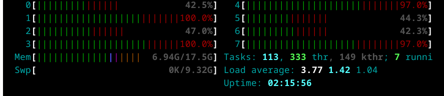

```{r, include = FALSE}
knitr::opts_chunk$set(
  collapse = TRUE,
  comment = "#>"
)
```

After completing the [business understanding](https://angelfelizr.github.io/NycTaxi/phases/02-business-understanding.html) phase we are ready to perform the **data understanding** phase by performing an EDA with the following steps:

1.  Exploring the individual distribution of variables.
2.  Exploring correlations between predictors and target variable.
3.  Exploring correlations between predictors.

As this will help to:
-   Ensure data quality
-   Identify key predictors
-   Guide model choice and feature engineering


## Setting the environment up

### Loading packages to use

```{r warning = FALSE, message = FALSE}
## Custom functions
library('project.nyc.taxi')

## To manage relative paths
library(here)

## To transform data larger than RAM
library(DBI)
library(duckdb)

## To transform data that fits in RAM
library(data.table)
library(lubridate)
library(future)
library(future.apply)

## To create plots
library(ggplot2)
library(scales)

## Defining the print params to use in the report
options(datatable.print.nrows = 15, digits = 4)
```

### Creating DB connections

```{r}
con <- dbConnect(duckdb(), dbdir = here("my-db.duckdb"))

dbListTables(conn = con)
```

### Sampling data to use

As we have too much data will only need 532,466 samples for training and testing the model.

```r
ValidZoneSampleQuery <- glue::glue("
CREATE TABLE ValidZoneSample AS
SELECT t1.*
FROM NycTrips t1
INNER JOIN ZoneCodesFilter t2
  ON t1.PULocationID = t2.PULocationID AND
     t1.DOLocationID = t2.DOLocationID
USING SAMPLE 0.20% (system, 547548);
")

dbExecute(con, ValidZoneSampleQuery)
```

### Adding the variable to predict

Once we have a sample of the data, we can add the variable to predict as it isn't part of the of original data by following the next steps:

1. Importing the data.

```{r}
ValidZoneSample <- dbGetQuery(con, "SELECT * FROM ValidZoneSample")
PointMeanDistance <- dbGetQuery(con, "SELECT * FROM PointMeanDistance")
```

2. Changing tables to become data.tables.

```{r}
setDT(ValidZoneSample)
setDT(PointMeanDistance)
```

3. Split the data by month and link with the original parquet files.

```{r}
ValidZoneSampleByMonth <-
  ValidZoneSample[
    j = request_datetime_extra := request_datetime + minutes(15)
  ][floor_date(request_datetime_extra, unit = "month") == floor_date(request_datetime, unit = "month"),
    .(data = list(.SD)), 
    keyby = c("year", "month"),
    .SDcols = !c("request_datetime_extra")
  ][, source_path := dir("raw-data/trip-data", recursive = TRUE, full.names = TRUE)]

tibble::as_tibble(ValidZoneSampleByMonth)
```

3. Defining configuration of parallel process.

```{r}
data.frame(Scheduling = c(0.4, 0.5, 0.6, 0.4, 0.5, 0.6, 0.4, 0.5, 0.6, 0.4, 0.5),
           Chunk.size = c(25, 25, 25, 50, 50, 50, 100, 100, 100, 200, 200),
           Duration = c(528.970, 428.321, 407.558, 382.662, 384.741, 380.178, 379.015, 379.000, 377.592, 373.415, 379.463)) |> 
  ggplot(aes(Chunk.size, 
             Duration, 
             group = Scheduling,
             color = as.character(Scheduling))) +
  geom_line() +
  geom_point() +
  scale_y_log10() +
  labs(title = "Future Performace",
       color = "Scheduling")
```


3. Run the process in parallel

```r
data.table::setDTthreads(1)
options(future.globals.maxSize = 20 * 1e9)
plan(multicore, workers = 7)

ValidZoneSampleByMonthTarget <- ValidZoneSampleByMonth[
  j = add_take_current_trip(trip_sample = data[[1L]],
                            point_mean_distance = PointMeanDistance,
                            parquet_path = source_path,
                            future.scheduling = 0.4,
                            future.chunk.size = 200),
  by = c("year", "month")
]

dbWriteTable(con, "ValidZoneSampleByMonthTarget", ValidZoneSampleByMonthTarget)
```

By running `htop` in the terminal we can confirm that **the process is running as expected**:

1. We are using all the 8 cores of the computer.
2. The process is running in the 17GB of RAM.




```{r echo=FALSE}
ValidZoneSampleByMonthTarget <- dbGetQuery(con, "SELECT * FROM ValidZoneSampleByMonthTarget")
```


```{r}
dbDisconnect(con, shutdown = TRUE)

rm(con)
```

